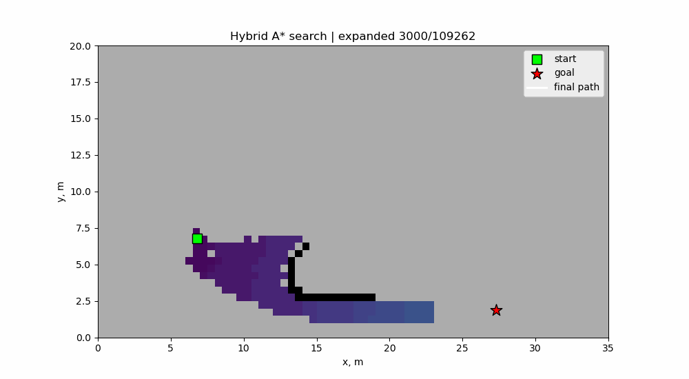

# Hybrid A* Planner

Hybrid A* planner на C++ для планирования траектории автономного автомобиля в 2D occupancy grid, с Python-визуализацией, сценариями, тестами и benchmark'ами.

Проект строится вокруг C++ core-библиотеки планировщика, явных форматов данных для сценариев/результатов и лёгких Python-утилит для визуализации и анализа benchmark'ов.



## Roadmap

1. `[готово]` Bootstrap workspace: структура репозитория, CMake, GoogleTest, минимальный executable, scenario-заглушки.
2. `[готово]` Common utilities: `Pose2D`, математические helpers, нормализация углов и unit tests.
3. `[готово]` Occupancy grid basics: размеры карты, resolution, occupied/free cells, bounds checking, world/grid преобразования.
4. `[готово]` Vehicle model basics: параметры автомобиля и простой kinematic bicycle step.
5. `[готово]` Vehicle footprint: oriented rectangle автомобиля по `Pose2D` и `VehicleParams`.
6. `[готово]` Collision checking: проверка footprint against occupancy grid.
7. `[готово]` Motion primitives: forward/reverse successors на основе vehicle model.
8. `[готово]` Heuristic и path/result export.
9. `[готово]` Baseline Hybrid A* search.
10. `[готово]` Минимальный demo-runner и Python plotting script.
11. `[в плане]` Benchmark scenarios, animation scripts и search statistics.
12. `[в плане]` Smoothing и coarse-to-fine refinement.

## Структура Репозитория

```text
.
├── configs/        # Конфигурации planner'а и benchmark'ов
├── docs/           # Заметки по дизайну и алгоритмам
├── include/        # Публичные C++ headers
├── src/            # Реализация C++ и entrypoint приложения
├── tests/          # Unit tests
├── scenarios/      # Входные JSON-сценарии
├── scripts/        # Python-утилиты для визуализации и benchmark'ов
├── results/        # Сгенерированные результаты planner'а
└── third_party/    # Опциональные внешние зависимости или заметки
```

## Сборка

Первый запуск CMake может скачать GoogleTest через `FetchContent`.

```bash
cmake -S . -B build -DCMAKE_BUILD_TYPE=Debug
cmake --build build
ctest --test-dir build --output-on-failure
./build/hybrid_astar_app
```

## Demo

Запуск demo строит небольшую occupancy grid сцену, запускает baseline Hybrid A* planner и сохраняет результат:

```bash
./build/hybrid_astar_app
```

Выходные файлы:

```text
results/path.csv
results/result.json
results/map.json
```

Визуализация результата:

```bash
python3 scripts/plot_result.py
```

Чтобы сохранить картинку без открытия окна:

```bash
python3 scripts/plot_result.py --save results/path.png
```

GIF-анимация процесса поиска:

```bash
python3 scripts/animate_search.py --output results/search.gif
```

В GIF неизученные клетки остаются серыми, раскрытые препятствия рисуются чёрным, а expanded cells окрашиваются градиентом по distance/cost from start. Радиус раскрытия препятствий можно настроить:

```bash
python3 scripts/animate_search.py --obstacle-reveal-radius 1 --output results/search.gif
```

Для визуализации нужен `matplotlib`.

## Текущий Статус

- C++ project scaffold готов.
- Common math/angle utilities покрыты unit tests.
- Occupancy grid реализует базовую карту и преобразования world/grid.
- Vehicle model реализует базовый kinematic bicycle step.
- Vehicle footprint вычисляет углы прямоугольного footprint автомобиля.
- Collision checker проверяет footprint against occupancy grid.
- Motion primitive generator создаёт forward/reverse successors.
- Heuristic оценивает distance + angle term; result exporter пишет path CSV, result JSON с expanded trace и map JSON.
- Baseline Hybrid A* planner реализует priority-queue search с дискретизацией grid cell + heading bin.
- `hybrid_astar_app` запускает demo-сцену и экспортирует результат в `results/`.
- `hybrid_astar_tests` содержит GoogleTest-based unit tests; сейчас проходит `56/56` тестов.
- Scenario JSON файлы пока являются заглушками и ещё не загружаются из C++.
